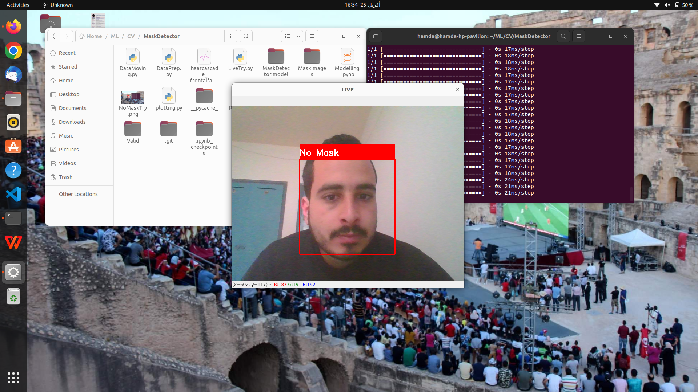

# Face Mask Detector
Real time face-mask detection using Deep Learning and OpenCV

## About Project
This project uses a Deep Neural Network, more specifically a Convolutional Neural Network, to differentiate between images of people with and without masks. The CNN manages to get 
an accuracy of **98.85% on the training set** and **72% on the test set**. Then the stored weights of this CNN are used to classify as mask or no mask, in real time, using OpenCV.
With the webcam capturing the video, the frames are preprocessed and and fed to the model to accomplish this task.

#### The model is capable of predicting multiple faces with or without masks at the same time

## Working 

### With Mask

### No Mask

## Dataset

The data used is provided by Zindi within the <a href="https://zindi.africa/competitions/spot-the-mask">Spot the Mask Challenge</a> it can be downloaded from this <a href="https://zindi.africa/competitions/spot-the-mask/data">Link</a> from this repository as well (folders 'Valid' and 
'Train'). There are 1046 training images and 262 valid images divided into two catgories, with (MaskOn) and without mask (MaskOff).

#### The Project is now ready to use !!

